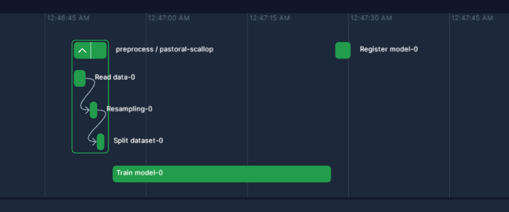
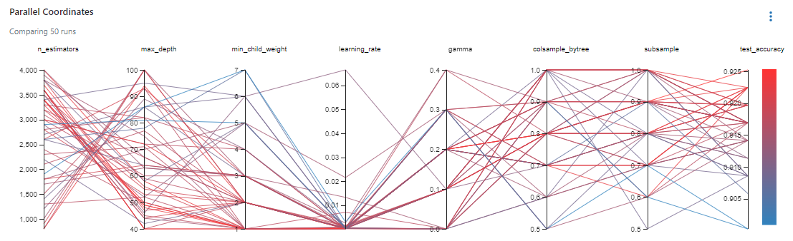
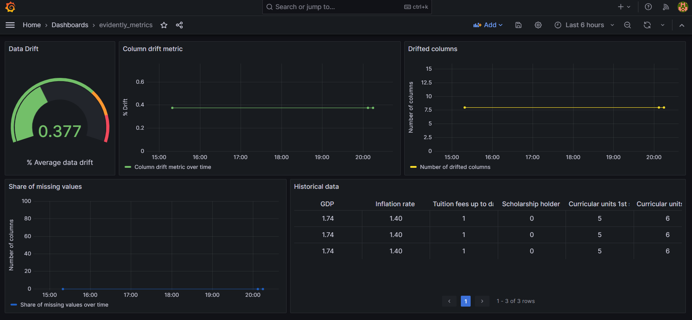

# Students' dropout prediction

### Problem Statement:

Addressing the issue of student dropout stands as a pivotal challenge within educational institutions, underscoring the significance of proactively identifying students who are susceptible to discontinuing their studies. Such timely identification not only holds the potential to bolster retention rates but also to foster a climate of enhanced student accomplishment.

This undertaking sets forth a comprehensive objective: the construction of a predictive machine learning model adept at discerning students in jeopardy of dropping out. By achieving this, the project endeavors to usher in a regime of prompt intervention and tailored assistance, ensuring that struggling students receive the support they need to persist and thrive.

The primary aim of this endeavor is the formulation of a resilient machine learning model, one that excels in accurately prognosticating instances of student attrition within educational establishments. This aspiration is fortified through the strategic application of MLOps methodologies. By harnessing the capabilities of AWS's technological stack and employing Terraform for the facilitation of Infrastructure as Code (IaC), a comprehensive end-to-end data pipeline is poised to materialize.

This intricate pipeline encompasses a spectrum of functionalities including streamlined orchestration, real-time streaming predictions, meticulous experiment monitoring, and the seamless integration of continuous integration/continuous deployment (CI/CD) protocols via GitHub workflows. It is imperative to underscore that this holistic approach extends to encompassing both unit and integration tests, thereby fortifying the reliability and efficacy of the model. Furthermore, the incorporation of meticulously crafted shell scripts serves as a cornerstone, driving automated processes that underpin efficient model deployment mechanisms.

## Dataset

A dataset created from a higher education institution (acquired from several disjoint databases) related to students enrolled in different undergraduate degrees, such as agronomy, design, education, nursing, journalism, management, social service, and technologies.

URL: https://archive-beta.ics.uci.edu/dataset/697/predict+students+dropout+and+academic+success

## MLOps tools

- **AWS Kinesis**: Facilitates the seamless management of event inputs and outputs, ensuring a smooth flow of data within the ecosystem.

- **AWS Lambda**: Acts as the orchestrator, efficiently handling the execution of functions and managing the intricacies of the underlying processes.

- **S3**: Assumes the role of a robust storage repository, housing and preserving MLflow buckets that encapsulate valuable artifacts and data.

- **MLFlow**: Emerges as an indispensable tool for experiment tracking and model registry, offering a structured approach to managing the entire machine learning lifecycle.

- **Grafana**: Empowers the monitoring of models and the timely detection of any deviations or drifts that might arise, bolstering the model's reliability.

- **Streamlit**: Presents an intuitive and user-friendly interface, leveraging its capabilities to create an uncluttered yet effective platform for interacting with deployed models.

- **Pre-commit**: Functions as a gatekeeper, ensuring stringent quality checks are in place before any code is committed, maintaining the integrity of the codebase.

- **Unit and Integration Tests**: Take on the responsibility of validating the functionality of the code components, ensuring that each piece works as intended individually and when integrated.

- **CI/CD Workflow**: Embodies a comprehensive approach to Continuous Integration and Continuous Deployment, underlining the importance of maintaining a fluid and automated development cycle.

- **Terraform**: Steps forward as a pivotal resource, aiding in the construction of an AWS-based infrastructure with precision and reproducibility, an essential element of the project's foundation.

## Directory layout
```
.
├── .github                          # CI/CD workflows
├── config/                          # Config files
├── images/                          # Assets
├── infrastructure/                  # Terraform files for IaC
|   ├── modules/                     # Modules to create AWS resources
|   |   ├── ecr/                     # ECR resource for the docker registry
|   |   ├── kinesis/                 # Kinesis resource for input/output events
|   |   ├── lambda/                  # Lambda resource for executing the function
|   |   ├── s3/                      # S3 resource to store mlflow models
|   ├── vars/                        # Variables
├── model_monitoring/                # CI/CD workflowsDirectory for monitoring the model
├── notebooks/                       # Notebooks used to analysis prior to development
├── orchestration/                   # Directory for workflow orchestration-related files
├── scripts/                         # Bash scripts
├── streaming/                       # Directory for handling streaming dataastAPI directoryF
|   ├── integration-tests/           # Integration tests for the streaming module
|   |   ├── artifacts/               # Files to manage global configuration variables and settings
|   |   |   ├── encoders/            # Pickle files of LabelEncoder
|   |   |   ├── model/               # Files related to the model
|   ├── tests/                       # Unit tests for the streaming module
|   ├── lambda_function.py           # Entrypoint for the application
|   ├── model.py                     # Functions and classes related to the model
├── .env.example                     # Template to set environment variables
├── .pre-commit-config.yaml          # Configuration file for pre-commit hooks
├── Dockerfile                       # Docker configuration for building the application
├── Makefile                         # Configuration of commands to automate the applications
├── Pipfile                          # Requirements for development and production
├── Pipfile.lock                     # Lock file for Pipfile dependencies
└── pyproject.toml                   # Project metadata and dependencies (PEP 518)
└── README.md
```

## Notebooks

Run notebooks in `notebooks/` directory to conduct Exploratory Data Analysis and experiment with features selection and feature creation using Feature-engine module ideally created for these purposes [See more in References](#section-one). Diverse experiments were carry out using RandomForest, SVM, XGBoost, with the latter showing the best performance. The resultant features were persistent into a yaml file containing other global properties. In this project, just 7 features were extracted out of the 37 original through Recursive Feature Addition technique.

## Cloud instructions

This project is only reproducible across cloud technologies.

### Prepare environment variables

Rename `.env.example` to `.env` and set the variables accordingly. Make sure your AWS user has the right policies to reproduce this project.

### Create infrastructure

1. `make terraform_init_plan`
2. `make terraform_apply`
3. `make deploy_manual`
4. `make send_test_record`

### MLFlow and Orchestration

1. Setup in EC2: Into the EC2 CLI type this

```bash
sudo yum update
yum install pip
pip install mlflow psycopg2-binary
mlflow server \
        --host 0.0.0.0 \
        --port 5000 \
        --default-artifact-root ${BUCKET} \
        --backend-store-uri postgresql://${MLFLOW_DB_USER}:${MLFLOW_DB_PASSWORD}@${HOST}:5432/${MLFLOW_DB_NAME}
```

2. Activate environment

* Windows
```bash
source $(pipenv --venv)/Scripts/activate
```

* UNIX
```bash
pipenv shell
```

4. Training workflow: Get data, preprocess, train and register model

```bash
prefect cloud login

python orchestration/train.py
```
Expected output in Prefect:



* Or execute them separately if you wish to experiment with other models or hyperparams:

```bash
python orchestration/preprocess.py
python orchestration/create_experiment.py (Optional) Used to test with different models
python orchestration/optimize.py
```
The experiment's chart view should look like this after running `optimize.py` script:



5. Finally, deployment:

 ```bash
python orchestration/deployment.py
prefect agent start -p default-agent-pool
 ```

## Start services

```bash
docker-compose up --build
```

* `http://localhost:3000`: Grafana monitor
* `http://localhost:3000`: Adminer
* `http://localhost:3000`: Lambda function
* `http://localhost:3000`: Streamlit UI
* `http://localhost:3000`: Postgres DB


Sending data

```bash
make send_test_record
```

Reading from the stream

```bash
KINESIS_STREAM_OUTPUT=student-dropout-output-stream
SHARD=shardId-000000000000

SHARD_ITERATOR=$(aws kinesis get-shard-iterator \
        --shard-id ${SHARD} \
        --shard-iterator-type TRIM_HORIZON \
        --stream-name ${KINESIS_STREAM_OUTPUT} \
        --query 'ShardIterator'
)

RESULT=$(aws kinesis get-records --shard-iterator $SHARD_ITERATOR)

echo ${RESULT}
```

## Monitor

Go to `http://localhost:3000`



## Plan

- [x] Testing the code: unit tests with pytest
- [x] Integration tests with docker-compose
- [x] Testing cloud services with LocalStack
- [x] Code quality: linting and formatting
- [x] Git pre-commit hooks
- [x] Makefiles and make
- [x] Infrastructure as Code
- [x] CI/CD/CT and GitHub Actions

## References {#section-one}

* M.V.Martins, D. Tolledo, J. Machado, L. M.T. Baptista, V.Realinho. (2021) "Early prediction of student’s performance in higher education: a case study" Trends and Applications in Information Systems and Technologies, vol.1, in Advances in Intelligent Systems and Computing series. Springer. DOI: 10.1007/978-3-030-72657-7_16

* Feature-engine: https://feature-engine.trainindata.com/en/latest/
